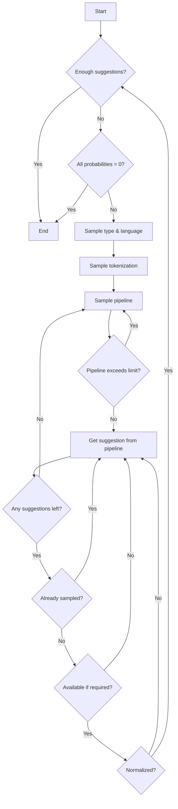

<!-- VERTICAL WHITESPACE -->

<br>
<br>

<!-- LOGO -->

<p align="center">
  <a href="https://namegraph.dev">
    <picture>
      <source media="(prefers-color-scheme: dark)" srcset="docs/media/logo-light.svg">
      
    </picture>
  </a>
</p>

<!-- TAGLINE -->
<p align="center">
  Surf more than 21 million name ideas across more than 400,000 name collections,<br>or generate infinite related name suggestions.
<p>

<!-- PROJECT SHIELDS -->
<p align="center">
  <!-- TODO: Add license shield once license is finalized -->
  <!-- <a href="LICENSE">
    <picture>
      <source media="(prefers-color-scheme: dark)" srcset="https://img.shields.io/github/license/namehash/namekit?color=444444">
      
    </picture>
  </a> -->
  <a href="https://github.com/namehash/namegraph/actions/workflows/build.yml">
    <picture>
      <source media="(prefers-color-scheme: dark)" srcset="https://github.com/namehash/namegraph/actions/workflows/build.yml/badge.svg?branch=prod">
      
    </picture>
  </a>
  <a href="https://github.com/namehash/namegraph/actions/workflows/ci.yml">
    <picture>
      <source media="(prefers-color-scheme: dark)" srcset="https://github.com/namehash/namegraph/actions/workflows/ci.yml/badge.svg?branch=master">
      
    </picture>
  </a>
  <a href="#project-status">
    <picture>
      <source media="(prefers-color-scheme: dark)" srcset="https://img.shields.io/badge/status-beta-444444">
      
    </picture>
  </a>
</p>

# Project Status

NameGraph is currently in beta. We are excited to share our work with you and continue to build the greatest web of names in history!

# Overview

NameGraph is a web service that generates name suggestions for a given input label. It is implemented using FastAPI and provides a variety of endpoints to generate suggestions in different modes and with different parameters.

## Label Analysis

The input label is analyzed to determine the most relevant name suggestions. The analysis includes:

- Defining all possible interpretations of the input label along with their probabilities (whether it is a sequence of common words, a person name, what is the language, etc.)
- For each interpretation, determining most probable tokenizations (e.g. `armstrong` -> `["armstrong"]`, `armstrong` -> `["arm", "strong"]`)

The suggestions are later generated based on these interpretations, tokenizations being especially important, since many generators greatly rely on them. This is why the endpoints can handle pretokenized input.

## Collections

Collections are curated sets of names that serve as a core component of NameGraph's name suggestion system. The system maintains a vast database of over 400,000 name collections containing more than 21 million unique names. Each collection is stored in Elasticsearch and contains:

- A unique collection ID
- Collection title and description
- Collection rank and metadata
- Member names with their normalized and tokenized forms
- Collection types and categories
- Related collections

Collections are used in several key ways:

1. Direct Name Generation:
   - Searches collections based on input tokens
   - Uses [learning-to-rank models](#learning-to-rank) to find relevant collections

2. Related Collections:
   - Finds collections with similar themes and content
   - Ensures diverse suggestions across different categories

3. Membership Lookup:
   - Discovers collections containing specific names
   - Enables finding thematically related names

The collections are maintained and updated through our [NameGraph Collections](https://github.com/namehash/namegraph-collections) project, ensuring the suggestion database stays current and comprehensive.

## Generators

Generators are core components that create name suggestions through different methods. Each generator inherits from the base [NameGenerator](namegraph/generation/name_generator.py) class and implements specific name generation strategies. They can be grouped into the categories as shown in the diagram below:

<p align="center">
  <picture>
    <source media="(prefers-color-scheme: dark)" srcset="docs/media/generators.dark.svg">
    
  </picture>
</p>

## Modes

NameGraph supports three modes for processing requests:

- Instant Mode (`instant`):
  - Fastest response time
  - More basic name generations
  - Some advanced generators like W2VGenerator are disabled (weight multiplier = 0)
  - Often used for real-time suggestions

- Domain Detail Mode (`domain_detail`):
  - Intermediate between instant and full
  - More comprehensive than instant, but still optimized for performance
  - Some generators have reduced weights compared to full mode
  - Expanded search window for collection ranking and sampling

- Full Mode (`full`):
  - Most comprehensive name generation
  - Includes all enabled generators
  - Uses full weights for most generators
  - Accesses advanced generators like `Wikipedia2VGenerator` and `W2VGenerator`
  - Takes longer to process, but provides the most diverse results


Different generators are enabled/disabled for each mode. Take a look at the [generators diagram](#generators) to see which generators are available in each mode.

<div align="center">
<table>
  <tr>
    <th>Icon</th>
    <th>Mode</th>
    <th>Description</th>
  </tr>
  <tr>
    <td><picture><source media="(prefers-color-scheme: dark)" srcset="docs/media/instant.dark.svg"></picture></td>
    <td>Instant</td>
    <td>Fastest response, basic generators only</td>
  </tr>
  <tr>
    <td><picture><source media="(prefers-color-scheme: dark)" srcset="docs/media/domain-detail.dark.svg"></picture></td>
    <td>Domain Detail</td>
    <td>Balanced speed/quality, expanded search</td>
  </tr>
  <tr>
    <td><picture><source media="(prefers-color-scheme: dark)" srcset="docs/media/full.dark.svg"></picture></td>
    <td>Full</td>
    <td>Comprehensive generation with all generators</td>
  </tr>
</table>
</div>

## Sampler

The sampler is a sophisticated component that manages the selection and generation of name suggestions. It implements a probabilistic sampling algorithm that balances diversity, relevance, and efficiency while respecting various constraints.

### Key Components

- **Request Parameters**:
  - `mode`: Determines which generators are active (`instant`/`domain_detail`/`full`)
  - `min_suggestions`: Minimum number of suggestions to return
  - `max_suggestions`: Maximum number of suggestions to return
  - `min_available_fraction`: Minimum fraction of suggestions that must be available

- **Interpretations**: Each input name can have multiple interpretations, characterized by:
  - Type (`ngram`, `person`, `other`)
  - Language
  - Probability score
  - Possible tokenizations

### Sampling Algorithm

The sampler uses a probabilistic approach to generate diverse and relevant name suggestions:



The algorithm works as follows:

1. **Initialization**: For each type-language pair, pipeline probabilities are computed.

2. **Main Loop**: The sampler iterates until either:
   - Enough suggestions are generated (`max_suggestions` met)
   - All pipeline probabilities become zero

3. **Sampling Process**:
   - First samples a type and language pair
   - Then samples a specific tokenization within that pair
   - Selects a pipeline using probability-based sampling
   - First pass uses sampling without replacement for diversity
   
4. **Validation Checks**:
   - Verifies pipeline hasn't exceeded its global limit
   - Ensures suggestions aren't duplicates
   - Checks availability status if required
   - Confirms normalization status

5. **Pipeline Management**:
   - Exhausted pipelines are removed from the sampling pool
   - When a pipeline can't generate more suggestions, falls back to other pipelines

This approach ensures a balanced mix of suggestions while maintaining efficiency and respecting all configured constraints.

# Usage

NameGraph uses [Poetry](https://python-poetry.org/) for dependency management and packaging. Before getting started, make sure you have Poetry installed on your system.

## Prerequisites

Install Poetry if you haven't already:
```bash
curl -sSL https://install.python-poetry.org | python3 -
```

Visit [Poetry installation guide](https://python-poetry.org/docs/#installation) for more details.

## Install

Clone the repository and install dependencies:
```bash
git clone https://github.com/namehash/namegraph.git
cd namegraph
poetry install
```

## Download resources

Additional resources need to be downloaded. Run these commands within the Poetry environment:

```bash
poetry run python download.py  # dictionaries, embeddings
poetry run python download_names.py
```

## Configuration

NameGraph uses [Hydra](https://hydra.cc/) - a framework for elegantly configuring complex applications. The configuration is stored in the `conf/` directory and includes:

- Main configuration files (`prod_config_new.yaml`, `test_config_new.yaml`) with core settings like connections, filters, limits, and paths
- Pipeline configurations in `conf/pipelines/` defining generators, modes, categories, and language settings

The configuration is highly modular and can be easily modified to adjust the behavior of name generation, filtering, and ranking systems.

## REST API

Start server using Poetry:
```bash
poetry run uvicorn web_api:app --reload
```

Query with POST:
```bash
curl -d '{"label":"armstrong"}' -H "Content-Type: application/json" -X POST http://localhost:8000
```

Query with POST (pretokenized input):
```bash
curl -d '{"label":"\"arm strong\""}' -H "Content-Type: application/json" -X POST http://localhost:8000
```

**Note:** pretokenized input should be wrapped in double quotes.

## Documentation

The API documentation is available at `/docs` or `/redoc` when the server is running. These are auto-generated Swagger/OpenAPI docs provided by FastAPI that allow you to:

- View all available endpoints
- See request/response schemas
- See descriptions of each parameter and response field
- Test API calls directly from the browser

Public API documentation is available at [api.namegraph.dev/docs](https://api.namegraph.dev/docs).

## Tests

Run tests using Poetry:
```bash
poetry run pytest
```

Tests that interact with external services (Elasticsearch) are marked with `integration_test` marker and are disabled by default. Define environment variables needed to access Elasticsearch and run them using:
```bash
poetry run pytest -m "integration_test"
```

## Learning-To-Rank

To access the LTR features, you need to configure it in the Elasticsearch instance (see [here](https://github.com/namehash/namegraph-collections/tree/master/research/learning-to-rank/readme.md) for more details).
